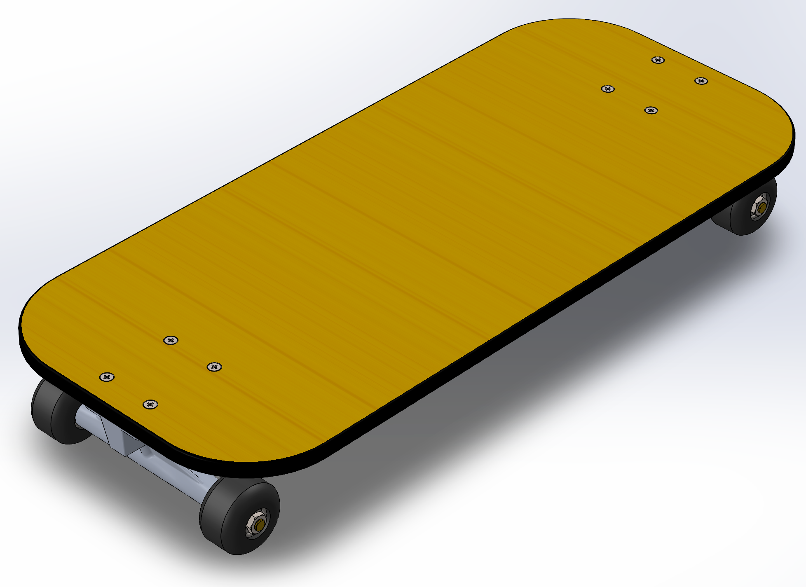
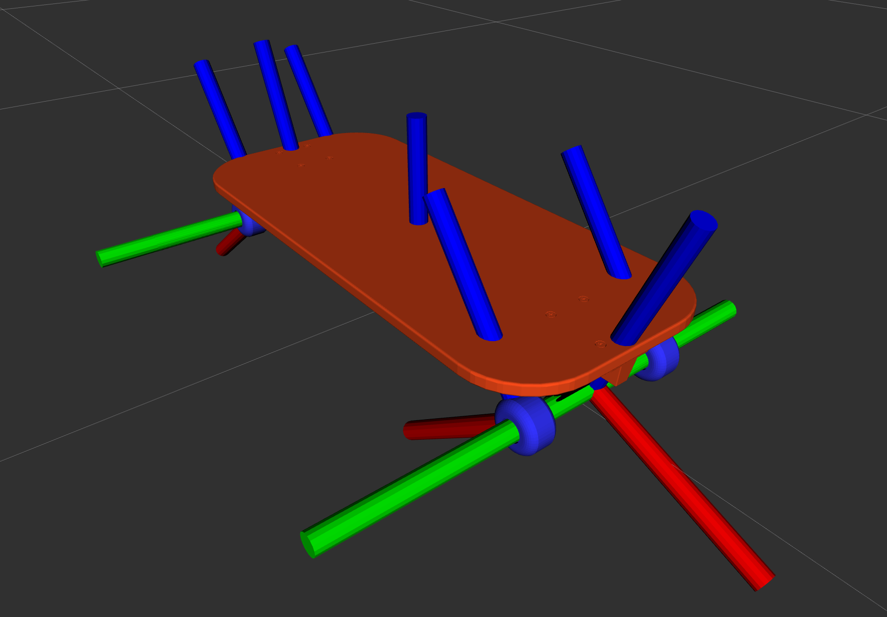

## 6-DoF Skateboard Robot

if you need real truck's bushings behaviour please use `<springStiffness>` tag for `trj0`, `trj1` joints in `.urdf` or plagin https://github.com/dancher00/ros2_gazebo_joint_torsional_spring_plugin for ROS2, https://github.com/aminsung/gazebo_joint_torsional_spring_plugin for ROS if you use Gazebo.

  <table>
    <tr>
      <td><b>3D CAD Model in SolidWorks</b></td>
      <td><b>RViz joint visualization</b></td>
    </tr>
    <tr>
      <td></td>
      <td></td>
    </tr>
  </table>

## Useful links

Original Add-In http://wiki.ros.org/sw_urdf_exporter

Good tutorial from EPFL https://www.epfl.ch/labs/biorob/wp-content/uploads/2019/02/SW2URDF_instructions.pdf

Redit discussion on ROS2 SW2URDF https://www.reddit.com/r/ROS/comments/134dsbx/solidworks_urdf_in_ros2/
